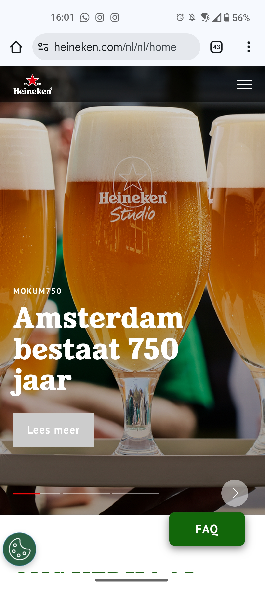
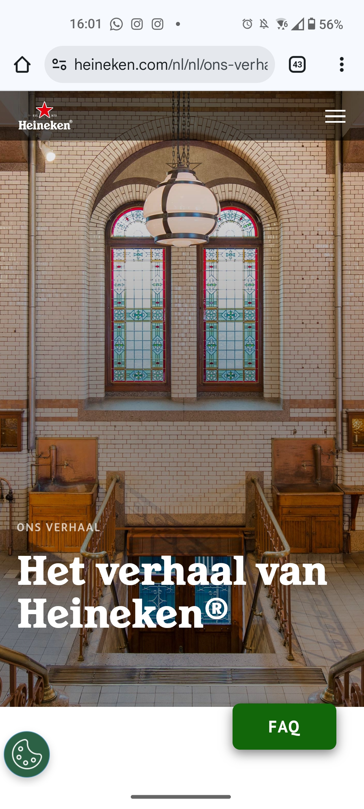

# Procesverslag
Markdown is een simpele manier om HTML te schrijven.  
Markdown cheat cheet: [Hulp bij het schrijven van Markdown](https://github.com/adam-p/markdown-here/wiki/Markdown-Cheatsheet).

Nb. De standaardstructuur en de spartaanse opmaak van de README.md zijn helemaal prima. Het gaat om de inhoud van je procesverslag. Besteedt de tijd voor pracht en praal aan je website.

Nb. Door *open* toe te voegen aan een *details* element kun je deze standaard open zetten. Fijn om dat steeds voor de relevante stuk(ken) te doen.

## Jij

  
uitwerken voor kick-off werkgroep

  ### Auteur:
  Bob Schilder

  #### Je startniveau:
  Ik ga voor de blauwe piste, coderen is namelijk niet mijn skerkste vaardigheid.

  #### Je focus:
  Surface plane
 

## Je website

  
uitwerken voor kick-off werkgroep

  ### Je opdracht:
https://www.heineken.com/nl/nl/home/

  #### Screenshot(s) van de eerste pagina (small screen): 
  Home
  
  

  #### Screenshot(s) van de tweede pagina (small screen):
Ons verhaal

 

## Toegankelijkheidstest 1/2 (week 1)

  
uitwerken na test in 2e werkgroep

  ### Bevindingen
Lijst met je bevindingen die in de test naar voren kwamen:

Veel moeite met het werkend maken van de hamburgermenu nav. Maar uiteindelijk opgelost. 
Moet nog veel gebeuren waaronder een breakdown schets.

## Breakdownschets (week 1)

  
uitwerken na afloop 3e werkgroep

  ### de hele pagina: 
  

  ### dynamisch deel (bijv menu): 
  

  ### wellicht nog een dynamisch deel (bijv filter): 
  

## Voortgang 1 (week 2)

  
uitwerken voor 1e voortgang

  ### Stand van zaken
 hier dit ging goed & dit was lastig (neem ook screenshots op van delen van je website en code) 

  ### Agenda voor meeting
Samen met je groepje opstellen

Manon

- In css dingen aanroepen. Wat je het beste voor elk ding kan gebruiken. (lnt-of-type() etc).
- Afbeeldingen uit een section kleiner maken als andere afbeeldingen, dan gewoon classes gebruiken?
- Font van de website in je code zetten?
- Border om afbeelding heen zetten.
- Footer einde
- Tekst in button een kleur geven

Gloria

- Ze wil wat vragen over het menu en over dingen aanroepen met css.

Bob

- Hij wil vragen hoe je automatische animaties makkelijk in de website kan maken.

Rosa

- Ze wil iets vragen over javascript.

  ### Verslag van meeting
hier na afloop snel de uitkomsten van de meeting vastleggen. We hebben deze week het gesprek samen met de studentassistenten gehad.

Ik moet betere alt teksten neerzetten. Ik moet het aan de hand van een zin uitleggen. Ik zou hiervoor ook chatGPT mogen gebruiken.
Mijn code is al goed ingesprongen en ik was daarmee ook lekker bezig.
Ik moet opletten dat ik geen buttons gebruik in plaats van links. Ik moet proberen buttons echt te gebruiken voor de dingen die op mijn pagina komen, zoals iwnkelwagen en misschien een andere pop-up. Als je naar een andere pagina wordt doorverwezen is het altijd een link. Dit moet ik dus nog even goed bekijken en aanpassen.
Als ik dan dit linkje een kleur wil geven dan kan ik background-color: black: color: white; gebruiken.
Ik gebruik heel veel li elementen, omdat dat dan n iet semantisch genoeg is kan ik soms beter article er nog tussen zetten. Dus: section - ul - li - article etc, wat er dan allemaal in staat.

## Voortgang 2 (week 3)

  
uitwerken voor 2e voortgang

  ### Stand van zaken
  hier dit ging goed & dit was lastig (neem ook screenshots op van delen van je website en code)

  ### Agenda voor meeting
  samen met je groepje opstellen

  | student 1      | student 2          | student 3    | student 4        |
  | ---            | ---                | ---          | ---              |
  | dit bespreken  | en dit             | en ik dit    | en dan ik dat    |
  | en dat ook nog | dit als er tijd is | nog een punt | dit wil ik zeker |
  | ...            | ...                | ...          | ...              |

  ### Verslag van meeting
  hier na afloop snel de uitkomsten van de meeting vastleggen

  - punt 1
  - punt 2
  - nog een punt
- ...

## Toegankelijkheidstest 2/2 (week 4)

  
uitwerken na test in 9e werkgroep

  ### Bevindingen
  Lijst met je bevindingen die in de test naar voren kwamen (geef ook aan wat er verbeterd is):

## Voortgang 3 (week 4)

  
uitwerken voor 3e voortgang

  ### Stand van zaken
  hier dit ging goed & dit was lastig (neem ook screenshots op van delen van je website en code)

  ### Agenda voor meeting
  samen met je groepje opstellen

  | student 1      | student 2          | student 3    | student 4        |
  | ---            | ---                | ---          | ---              |
  | dit bespreken  | en dit             | en ik dit    | en dan ik dat    |
  | en dat ook nog | dit als er tijd is | nog een punt | dit wil ik zeker |
  | ...            | ...                | ...          | ...              |

  ### Verslag van meeting
  hier na afloop snel de uitkomsten van de meeting vastleggen

  - punt 1
  - punt 2
  - nog een punt
  - ...

## Eindgesprek (week 5)

  
uitwerken voor eindgesprek

  ### Je uitkomst - karakteristiek screenshots:
  

  ### Dit ging goed/Heb ik geleerd: 
  Korte omschrijving met plaatjes

  

  ### Dit was lastig/Is niet gelukt:
  Korte omschrijving met plaatjes

  

## Bronnenlijst

  
continu bijhouden terwijl je werkt

  Nb. Wees specifiek ('css-tricks' als bron is bijv. niet specifiek genoeg). 
  Nb. ChatGpT en andere AI horen er ook bij.
  Nb. Vermeld de bronnen ook in je code.

  1. bron 1
  2. bron 2
  3. ...

